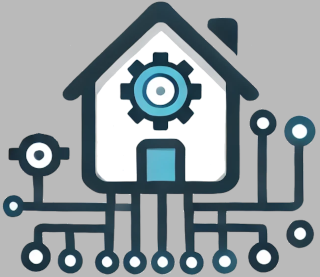

# LudHome

[][documentation]

# Description

An home assistant written in Rust. It is a personal project to help me to learn new technologies and to have fun.

It's separated in two main parts:

- The sensors, which are responsible to collect data and send it to the MQTT server
- The server, which is responsible to serve the data thru the Web and to read data from the MQTT server

## Features

- [ ] Web REST API to serve the data
- [ ] Web UI to display the data and dashboards
- [x] MQTT client to receive data from sensors
- Sensors:
    - [x] Temperature/Humidity sensor

